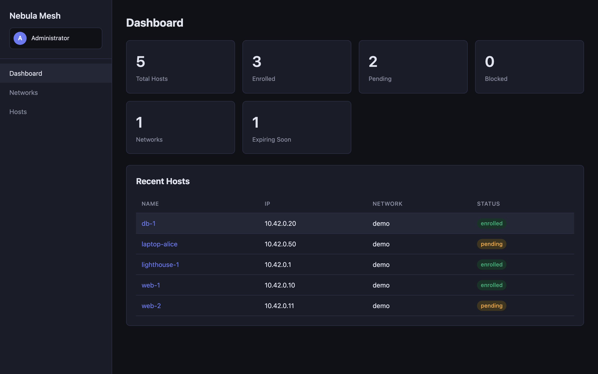

# nebula-mesh

[](https://github.com/juev/nebula-mesh/actions/workflows/ci.yml)
[](https://github.com/juev/nebula-mesh/releases/latest)
[](https://pkg.go.dev/github.com/juev/nebula-mesh)
[](https://goreportcard.com/report/github.com/juev/nebula-mesh)
[](LICENSE)
[](go.mod)

> Self-hosted control plane for [Slack's Nebula](https://github.com/slackhq/nebula) mesh VPN — issue certificates, manage hosts, distribute config, and roll out changes from one place.



<sub>
<strong>UI</strong>:
<a href="docs/screenshots/hosts.png">hosts</a> ·
<a href="docs/screenshots/host-detail.png">host detail</a> ·
<a href="docs/screenshots/host-new-advanced.png">host create (advanced)</a> ·
<a href="docs/screenshots/networks.png">networks</a> ·
<a href="docs/screenshots/profile.png">profile</a><br>
<strong>Auth</strong>:
<a href="docs/screenshots/login.png">login</a> ·
<a href="docs/screenshots/register.png">register</a> ·
<a href="docs/screenshots/2fa-setup.png">2FA setup</a> ·
<a href="docs/screenshots/2fa-enabled.png">2FA enabled + recovery codes</a> ·
<a href="docs/screenshots/login-totp.png">login → TOTP prompt</a>
</sub>

Nebula gives you a fast, mTLS-authenticated overlay network. But on its own, it leaves the operator to hand-roll certificate issuance, rotation, distribution and revocation — usually with shell scripts and a CA on a laptop. **nebula-mesh** is the missing management layer: a single Go binary plus an enrollment agent that turn Nebula into a self-service mesh you can run on one VM.

## Why

| | Hand-rolled scripts | DefinedNetworking (managed) | **nebula-mesh** |
|---|---|---|---|
| Self-hosted | ✅ | ❌ | ✅ |
| Web UI + REST API | ❌ | ✅ | ✅ |
| Cert rotation & revocation | manual | ✅ | ✅ |
| Single static binary | ✅ | n/a | ✅ |
| Cost | your time | per-host | free (MIT) |
| Lock-in | none | vendor | none |

## Features

- **Web UI + REST API + CLI** — one server, three interfaces. Built with chi + Go templates + htmx (no SPA build step).
- **PKI lifecycle** — per-operator CAs encrypted at rest in SQLite under a process-wide AES-256-GCM master key (envelope encryption per [ADR 0002](docs/adr/0002-per-operator-cas.md)); per-host certs signed via `slackhq/nebula/cert`; blocklist-backed revocation.
- **Multi-operator** — local accounts, OIDC (Keycloak / Authentik / Okta / …), TOTP 2FA with recovery codes, configurable self-registration, per-operator API keys with atomic disable.
- **Per-operator CAs** — each operator's networks form an isolated trust domain; non-admin operators cannot see or sign against another operator's CA.
- **Zero-trust enrollment** — hosts join with a single-use token; private keys never leave the host.
- **Auto-rotation** — agent polls the server, atomically writes new certs/config (temp + fsync + rename), reloads Nebula via `SIGHUP`.
- **Per-host advanced overrides** — `listen_host`, `mtu`, `tun_device`, `punchy`, `unsafe_routes` opt-in per host without touching the network default.
- **Audit trail** — every mutating UI / API / CLI call is recorded with actor, action, target, plus a stable `ca_id` on host events.
- **Per-network firewall rules** — managed declaratively via API, distributed to all hosts.
- **Production-ready basics** — `/healthz`, `/readyz`, Prometheus exporter at `/metrics` (legacy `expvar` view at `/debug/vars`), structured `slog` logs, optional in-process TLS, SQLite (WAL) with tracked migrations.
- **Tiny footprint** — two static binaries (~15–25 MiB each), SQLite, no external deps. Runs on a $5 VM.

## Architecture

```
┌──────────┐   REST/UI   ┌─────────────────────┐
│ operator │ ──────────▶ │   nebula-mgmt       │
└──────────┘   (HTTPS)   │  ┌───────────────┐  │
                         │  │ chi API       │  │
┌──────────┐   poll      │  │ web UI (htmx) │  │
│ nebula-  │ ──────────▶ │  │ PKI + store   │  │
│ agent    │ ◀────────── │  │ (SQLite WAL)  │  │
│ + nebula │   updates   │  └───────────────┘  │
└──────────┘             └─────────────────────┘
   each host                  one VM / container
```

- `nebula-mgmt` — management server (HTTP API + web UI + CLI subcommands)
- `nebula-agent` — runs on each Nebula host, polls for updates, atomically rewrites Nebula config, `SIGHUP`s Nebula

## Install

Each release ships **two** independent artifact sets — install only what you need on each machine.

| | Server (`nebula-mgmt`) | Agent (`nebula-agent`) |
|---|---|---|
| Where it runs | one VM / container — the control plane | every Nebula host — next to `nebula` |
| Binary tarball | `nebula-mgmt_<v>_<os>_<arch>.tar.gz` | `nebula-agent_<v>_<os>_<arch>.tar.gz` |
| Linux distro packages | — | `nebula-agent_<v>_linux_<arch>.{deb,rpm}` |
| Docker image | `ghcr.io/juev/nebula-mgmt` | `ghcr.io/juev/nebula-agent` |

### Linux distro packages — recommended for the agent

`nebula-agent` ships as `.deb` and `.rpm` for `amd64`, `arm64`, and `armv7` on every release. The package installs the binary at `/usr/bin/nebula-agent`, the systemd unit at `/lib/systemd/system/nebula-agent.service`, an example config at `/etc/nebula-agent/agent.example.yml`, and the operations guide at `/usr/share/doc/nebula-agent/agent.md`. The post-install script creates the `nebula-agent` system user but does **not** enable the service — you must enroll the host first.

```sh
TAG=$(curl -fsSL https://api.github.com/repos/juev/nebula-mesh/releases/latest | grep -m1 tag_name | cut -d'"' -f4)
ARCH=$(uname -m | sed 's/x86_64/amd64/;s/aarch64/arm64/;s/armv7l/armv7/')

# Debian / Ubuntu
curl -fsSL -O "https://github.com/juev/nebula-mesh/releases/download/${TAG}/nebula-agent_${TAG#v}_linux_${ARCH}.deb"
sudo apt install -y "./nebula-agent_${TAG#v}_linux_${ARCH}.deb"

# RHEL / Fedora / CentOS Stream / Rocky / Alma
sudo rpm -i "https://github.com/juev/nebula-mesh/releases/download/${TAG}/nebula-agent_${TAG#v}_linux_${ARCH}.rpm"

# After install: edit the example, enroll, then enable the unit.
sudo cp /etc/nebula-agent/agent.example.yml /etc/nebula-agent/agent.yml
sudoedit /etc/nebula-agent/agent.yml
sudo nebula-agent enroll --server <url> --token <token> --data-dir /etc/nebula
sudo systemctl enable --now nebula-agent.service
```

`/etc/nebula-agent/agent.yml` is marked `config|noreplace`, so upgrades preserve your edits. `apt purge` / `dnf remove --purge` drops the system user but keeps `/etc/nebula-agent` and `/etc/nebula` intact so host keys survive an accidental removal. Full lifecycle reference: [`docs/agent.md`](docs/agent.md#from-a-linux-distro-package-recommended-on-debian--ubuntu--rhel).

For `nebula-mgmt`, the agent on non-deb/rpm Linux distros, and non-Linux hosts, use the prebuilt tarball or Docker image below.

### Prebuilt binary (Linux / macOS / FreeBSD / Windows)

```sh
# Pick one: BIN=nebula-mgmt   (control-plane VM)
#          BIN=nebula-agent   (every Nebula host)
BIN=nebula-mgmt
OS=$(uname -s | tr '[:upper:]' '[:lower:]')
ARCH=$(uname -m | sed 's/x86_64/amd64/;s/aarch64/arm64/')
TAG=$(curl -fsSL https://api.github.com/repos/juev/nebula-mesh/releases/latest | grep -m1 tag_name | cut -d'"' -f4)
curl -fsSL "https://github.com/juev/nebula-mesh/releases/download/${TAG}/${BIN}_${TAG#v}_${OS}_${ARCH}.tar.gz" | tar -xz
```

Full agent target matrix (incl. Linux `arm v7`, FreeBSD, Windows): [`docs/agent.md#supported-release-matrix`](docs/agent.md). Each release ships a `checksums.txt` with SHA-256 of every archive.

### Docker (linux/amd64, linux/arm64)

```sh
# Server:
docker run -d --name nebula-mgmt \
  -p 8080:8080 \
  -v nebula-mgmt-data:/var/lib/nebula-mgmt \
  -v nebula-mgmt-etc:/etc/nebula-mgmt \
  -e NEBULA_MGMT_CA_PASSPHRASE \
  -e NEBULA_MGMT_MASTER_KEY \
  ghcr.io/juev/nebula-mgmt:latest

# Agent (typically sidecar to nebula, sharing the same PID namespace):
docker run -d --name nebula-agent \
  -v /etc/nebula-agent:/etc/nebula-agent \
  -v /etc/nebula:/etc/nebula \
  ghcr.io/juev/nebula-agent:latest
```

Images are published to GitHub Container Registry with `:X.Y.Z` (semver, no `v` prefix) and `:latest` tags. See [Packages](https://github.com/juev?tab=packages&repo_name=nebula-mesh).

### From source

Requires Go 1.26+.

```sh
make build           # outputs bin/nebula-mgmt and bin/nebula-agent
```

After install, `nebula-mgmt version` and `nebula-agent --version` print the build version, short commit, and build date.

## Quickstart

### Run the server

```sh
sudo mkdir -p /var/lib/nebula-mgmt /etc/nebula-mgmt
sudo cp configs/server.example.yml /etc/nebula-mgmt/server.yml

# Generate a master key for the per-operator CA store and put it in your
# secret manager. Provide it to the server via NEBULA_MGMT_MASTER_KEY (or
# the master_key field in server.yml).
openssl rand -base64 32

# One-time: creates CA, generates API key, persists both into the config.
sudo bin/nebula-mgmt init --config /etc/nebula-mgmt/server.yml

# Serve.
sudo bin/nebula-mgmt serve --config /etc/nebula-mgmt/server.yml
```

Open `http://localhost:8080/ui/` — log in as `admin` with the password configured in `ui_password` (falls back to the API key shown by `init`).

Non-interactive deployments (systemd, Docker): set `NEBULA_MGMT_CA_PASSPHRASE` and `NEBULA_MGMT_MASTER_KEY` instead of typing the passphrase at start.

### Enroll a host

```sh
# On the server — create a host record:
nebula-mgmt host create \
  --server https://mgmt.example.com:8080 \
  --api-key "$API_KEY" \
  --network "$NETWORK_ID" \
  --name web-1 --ip 192.168.100.10
# → prints an enrollment token

# On the host — one-time enrollment + start the polling agent:
sudo cp configs/agent.example.yml /etc/nebula-agent/agent.yml
sudo nebula-agent enroll \
  --server https://mgmt.example.com:8080 \
  --token "$ENROLL_TOKEN" \
  --data-dir /etc/nebula
sudo nebula-agent run --config /etc/nebula-agent/agent.yml
```

The agent keeps `host.crt` / `host.key` / `ca.crt` / `config.yml` in sync and signals Nebula on changes.

> Full nebula-agent operations guide: [`docs/agent.md`](docs/agent.md) — installation, configuration, troubleshooting, upgrade, and security notes.

### Manage hosts from the CLI

```sh
# List hosts (optionally filter by network)
nebula-mgmt host list --server https://mgmt.example.com:8080 --api-key "$API_KEY"

# Block a host (revokes cert via blocklist, status → blocked)
nebula-mgmt host block   --server ... --api-key "$API_KEY" --id "$HOST_ID"

# Unblock a host (status → pending; re-enrollment required for a new cert)
nebula-mgmt host unblock --server ... --api-key "$API_KEY" --id "$HOST_ID"

# Delete a host (also blocklists any existing cert)
nebula-mgmt host delete  --server ... --api-key "$API_KEY" --id "$HOST_ID"
```

## Operators, auth, and tenancy

Each interactive admin should have their own operator account and per-operator API key. On `nebula-mgmt init`, an `admin` operator is seeded from `ui_password` (or `api_key` as a fallback); the config `api_key` is registered as `admin`'s first API key and continues to work as a legacy fallback.

### Manage operators

```sh
# List operators
nebula-mgmt user list --server ... --api-key "$ADMIN_KEY"

# Create another operator (admin-only API)
nebula-mgmt user create --server ... --api-key "$ADMIN_KEY" \
  --username alice --password 's3cret!' --display-name "Alice"

# Per-operator API key (token shown once)
nebula-mgmt apikey create --server ... --api-key "$ADMIN_KEY" \
  --operator "$ALICE_ID" --name laptop-cli
nebula-mgmt apikey revoke --server ... --api-key "$ADMIN_KEY" \
  --operator "$ALICE_ID" --id "$KEY_ID"

# Disable / re-enable an operator — invalidates sessions and API keys atomically
nebula-mgmt user disable --server ... --api-key "$ADMIN_KEY" --id "$ALICE_ID"
nebula-mgmt user enable  --server ... --api-key "$ADMIN_KEY" --id "$ALICE_ID"
```

Audit log entries (`/api/v1/audit-log`) record the actor for every mutating operator/host action.

### Two-factor authentication (TOTP)

Open `/ui/2fa`, click **Enable 2FA**, scan the displayed `otpauth://` URL with 1Password / Bitwarden / Google Authenticator / Aegis / Authy / any compatible app, and confirm with a 6-digit code. The server then shows ten one-time recovery codes — save them offline. On the next login the UI asks for the 6-digit code (or one recovery code) after the password. Disabling 2FA requires re-confirming the current password. All sensitive operations (`operator.2fa.enabled`, `disabled`, `regen_codes`, `failed`, `verified`) appear in the audit log. API tokens are unaffected.

### Single sign-on via OIDC

Configure an `oidc:` block in `server.yml` (see `configs/server.example.yml`) to enable operator login through Keycloak / Authentik / Dex / Google Workspace / Okta / any standard OpenID Connect provider. The login page then shows a **Sign in with SSO** button alongside the local form.

```yaml
oidc:
  enabled: true
  issuer: "https://keycloak.example.com/realms/nebula"
  client_id: "nebula-mesh"
  client_secret: "<from your provider>"
  redirect_url: "https://mgmt.example.com:8080/ui/oidc/callback"
  scopes: ["openid", "profile", "email", "groups"]
  allowed_groups: ["nebula-admins"]
```

The first successful login for an unknown subject creates a local operator record (`auth_provider=oidc`) tied to the `issuer+subject` pair. Local and OIDC users coexist; revoke an OIDC user by disabling the local record or removing them in the IdP.

### Configurable self-registration

By default only administrators can create operator accounts. Set `allow_self_registration: true` in `server.yml` to let unauthenticated visitors sign up via `/ui/register`. Server-side checks gate the endpoint independently of the UI, so flipping the flag is enough to block self-registration. Self-registered operators get the `user` role; the operator-management API (`POST /api/v1/operators`, `disable`, etc) requires `role: admin`.

### Per-operator CAs

With `NEBULA_MGMT_MASTER_KEY` configured, operators can run their networks under isolated CAs:

```sh
# Create a CA scoped to a real operator (the legacy config key is denied)
nebula-mgmt ca create --server ... --api-key "$OPERATOR_KEY" --name tenant-a
# → prints CA id + fingerprint

nebula-mgmt ca list   --server ... --api-key "$OPERATOR_KEY"
nebula-mgmt ca delete --server ... --api-key "$OPERATOR_KEY" --id "$CA_ID"
```

Non-admin operators see and manage only the CAs they own; admins see all. Hosts enrolled under a tenant CA receive **that** CA's certificate, not the default one. Audit log entries (`ca.created`, `ca.deleted`, plus existing `host.*` events with the host's `ca_id`) record both the actor and the affected CA. See [ADR 0002](docs/adr/0002-per-operator-cas.md) for the encryption-at-rest design.

## Deployment

- **Docker** — `docker build -t nebula-mgmt .` (Dockerfile in repo).
- **systemd** — unit files in [`deploy/systemd/`](deploy/systemd/).
- **TLS** — set `tls_cert` + `tls_key` for in-process TLS, or front with nginx/caddy/traefik.

### Backups & key handling

Per [ADR 0002](docs/adr/0002-per-operator-cas.md) (supersedes [ADR 0001](docs/adr/0001-ca-key-storage.md)), CA private keys live encrypted inside SQLite using envelope encryption. The master key (`NEBULA_MGMT_MASTER_KEY`, 32 random bytes, base64-encoded) is supplied at startup and **never written to disk or the DB**. Backups collapse to a single file:

```sh
sudo cp /var/lib/nebula-mgmt/nebula.db /backups/nebula-$(date +%F).db
```

Keep `NEBULA_MGMT_MASTER_KEY` in your secret manager — both the DB and the master key are required to mint a certificate. The legacy `data_dir/ca.crt` / `data_dir/ca.key` produced by `nebula-mgmt init` are kept for one release as a rollback artifact, then deletable once the import into the `cas` table has succeeded.

## Endpoints

| Path | Auth | Purpose |
|---|---|---|
| `/healthz` | none | liveness |
| `/readyz` | none | readiness (DB reachable) |
| `/metrics` | none | Prometheus exposition (counters, histograms, gauges — see [`internal/api/metrics.go`](internal/api/metrics.go)). Disable via `metrics.prometheus: false` for air-gapped installs. |
| `/debug/vars` | none | Go `expvar` runtime stats (kept for backward compatibility). |
| `/ui/` | session cookie | web UI |
| `/api/v1/enroll` | enrollment token | agent first-contact |
| `/api/v1/agent/updates` | host cert | agent poll |
| `/api/v1/...` | `Bearer <api_key>` | admin REST API |

Full route list in [`internal/api/server.go`](internal/api/server.go).

## Status

**Beta.** Core flows (init, enroll, poll, rotate, revoke, audit, multi-CA) are covered by unit + integration tests with `-race`. API surface is not yet frozen — expect breaking changes until `v1.0.0`. Please open issues for anything rough.

## Roadmap

Open issues tracked individually so you can subscribe to the ones you care about:

- [#41](https://github.com/juev/nebula-mesh/issues/41) — Built-in cert-expiry alerts (audit + webhook + metric)
- [#42](https://github.com/juev/nebula-mesh/issues/42) — Bootstrap recipes (Terraform module, Ansible roles, cloud-init samples)
- [#43](https://github.com/juev/nebula-mesh/issues/43) — Web UI: live host status via SSE (today: htmx polling on a 30s interval)

Already delivered: multi-operator auth, OIDC SSO, TOTP 2FA, self-registration, per-operator CAs, advanced per-host overrides, automatic lighthouse assignment by host role, distro packages (deb/rpm) and the cross-platform agent build matrix.

Want to help? See [CONTRIBUTING.md](CONTRIBUTING.md).

## Security

- **Authentication.** Interactive logins are bcrypt-verified against the operator's password; sessions are DB-backed and revoked atomically on `user disable`. Optional TOTP 2FA + recovery codes. Optional OIDC SSO.
- **Authorization.** Operator-management API and CA-management API require `role: admin`; non-admin operators can only see and act on the CAs they own.
- **API keys.** Per-operator, stored as SHA-256 hashes — disable an operator and every key revokes in the same transaction. The legacy config-file `api_key` continues to work as a fallback for backward compatibility.
- **CA key material.** Stored encrypted at rest in SQLite under a process-wide AES-256-GCM master key (`NEBULA_MGMT_MASTER_KEY`), supplied at startup and never persisted. See [ADR 0002](docs/adr/0002-per-operator-cas.md) for the threat-model discussion.
- **Transport.** Always run the management server behind TLS — set `tls_cert` + `tls_key`, or front with nginx/caddy/traefik.
- **Disclosure.** Report vulnerabilities privately — see [SECURITY.md](SECURITY.md).

## Contributing

Issues, PRs, and discussions welcome. See [CONTRIBUTING.md](CONTRIBUTING.md) for the workflow and `make test && make lint` before opening a PR.

## License

MIT — see [LICENSE](LICENSE).

## Acknowledgements

Built on top of [`slackhq/nebula`](https://github.com/slackhq/nebula). nebula-mesh is an independent project and is not affiliated with or endorsed by Slack.
